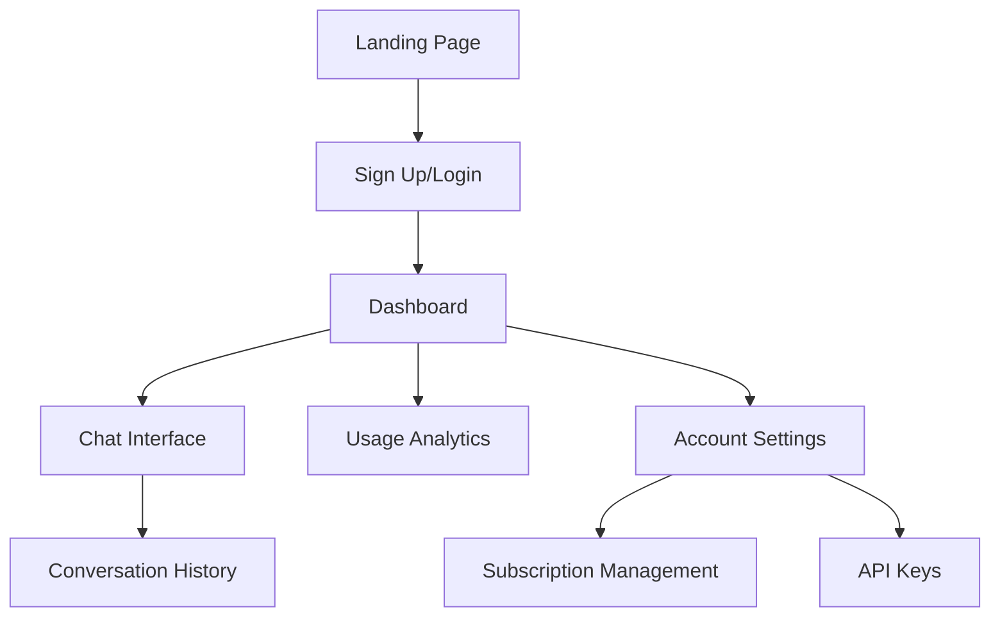
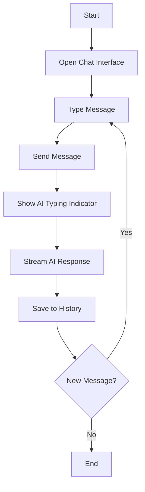

# AI SaaS Platform UI/UX Specification

## Overall UX Goals & Principles

- **Target User Personas:** AI startup founders, technical product managers,
  early adopters
- **Usability Goals:** Intuitive AI chat, clear subscription status,
  professional SaaS feel
- **Design Principles:**
  - Clarity in AI interactions
  - Professional trust-building
  - Efficient workflows
  - Responsive performance feedback

## Information Architecture

### Site Map



### Navigation Structure

- **Primary:** Top navigation with Dashboard, Chat, Analytics, Settings
- **Secondary:** Sidebar in chat for conversation history
- **Mobile:** Bottom tab navigation with hamburger menu

## Key User Flows

### AI Chat Interaction Flow



### Subscription Management Flow

- User views usage metrics
- Checks plan limits
- Upgrades/downgrades plan
- Updates billing information

## Component Library Requirements

### Core Components Needed

- **ChatMessage**: AI/user message display with streaming support
- **TypingIndicator**: Animated AI thinking indicator
- **UsageChart**: Real-time usage analytics visualization
- **PlanCard**: Subscription tier display with upgrade CTA
- **APIKeyManager**: Secure key display/regeneration

### Design System Integration

- Use shadcn/ui as base component library
- Custom AI-specific components built on top
- Consistent spacing using Tailwind CSS utilities

## Branding & Style Guide

### Color Palette

- **Primary:** #2563eb (Blue 600) - Trust, technology
- **Secondary:** #7c3aed (Violet 600) - AI, innovation
- **Success:** #059669 (Emerald 600) - Positive responses
- **Warning:** #d97706 (Amber 600) - Usage limits
- **Error:** #dc2626 (Red 600) - Errors, failures

### Typography

- **Headings:** Inter, semi-bold
- **Body:** Inter, regular
- **Code/Monospace:** JetBrains Mono

### AI-Specific Styling

- Subtle gradients for AI responses
- Typing animations with dots
- Progress bars for streaming responses

## Accessibility Requirements

- **Target Compliance:** WCAG 2.1 AA
- **Keyboard Navigation:** Full keyboard support for chat interface
- **Screen Reader:** Proper ARIA labels for AI status indicators
- **Color Contrast:** Minimum 4.5:1 ratio for all text

## Responsiveness

### Breakpoints

- **Mobile:** 320px - 767px
- **Tablet:** 768px - 1023px
- **Desktop:** 1024px+

### Adaptation Strategy

- Mobile: Single-column layout, bottom navigation
- Tablet: Split chat/sidebar layout
- Desktop: Full dashboard with sidebar navigation

## Chat Interface Specifications

### Message Layout

```
[Avatar] [Message Bubble with streaming text]
         [Timestamp] [Actions: Copy, Regenerate]
```

### Streaming Response UI

- Character-by-character streaming
- Smooth scroll to follow response
- Stop generation button
- Token/cost counter (if enabled)

### Input Area

- Auto-expanding textarea
- Send button with loading state
- File attachment for document upload
- Voice input button (future enhancement)

## Dashboard Analytics

### Key Metrics Display

- **Usage Overview:** API calls, tokens used, cost
- **Response Quality:** User ratings, regeneration rate
- **Performance:** Average response time, uptime
- **Billing:** Current usage vs plan limits

### Chart Types

- Line charts for usage over time
- Donut charts for plan utilization
- Bar charts for feature usage comparison

## Performance Considerations

### Loading States

- Skeleton screens for dashboard
- Progressive loading for chat history
- Optimistic UI for message sending

### Real-time Updates

- WebSocket connection status indicator
- Live usage metric updates
- Real-time typing indicators

## Mobile-Specific Considerations

### Touch Interactions

- Swipe gestures for chat navigation
- Pull-to-refresh for conversation updates
- Long-press context menus

### Mobile Chat UX

- Larger touch targets (44px minimum)
- Thumb-friendly navigation zones
- Auto-scroll behavior optimization
