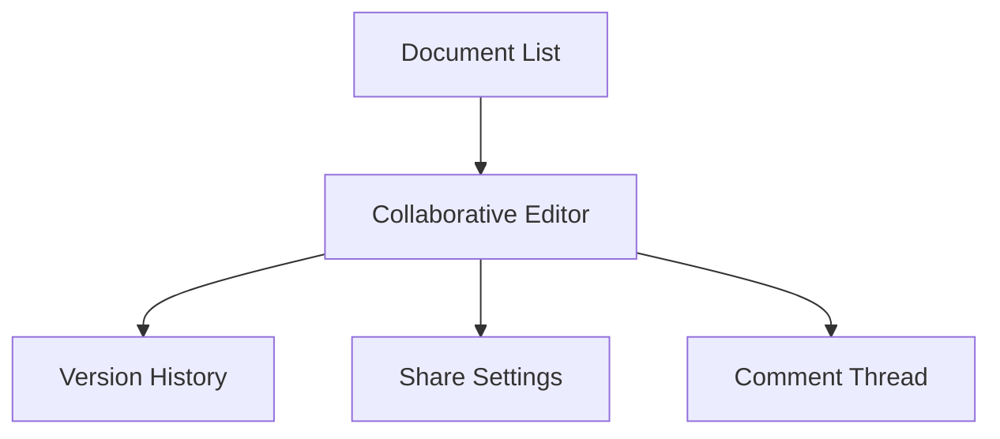
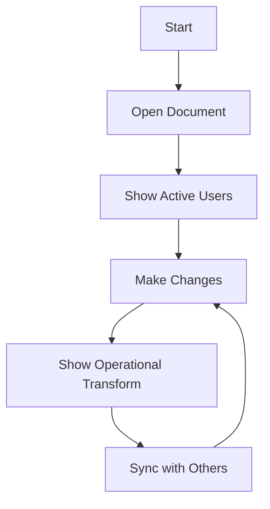

# Real-time Collaboration UI/UX Specification

## Overall UX Goals & Principles

- **Target Users:** Development teams, content creators, remote collaborators
- **Goals:** Seamless real-time editing, clear presence awareness, conflict
  resolution
- **Principles:** Immediate feedback, collaborative transparency,
  performance-first

## Information Architecture

### Core Views

## Key User Flows

### Real-time Editing Flow

## Component Specifications

### CollaborativeEditor

- **Purpose:** Main editing interface with real-time synchronization
- **Key Features:**
  - Operational transformation indicators
  - Live cursor positions
  - Conflict resolution UI
  - Change highlights

### PresenceIndicator

- **Purpose:** Show active collaborators
- **Features:**
  - User avatars with status
  - Cursor position indicators
  - Activity timestamps
  - Connection status

### ConflictResolutionModal

- **Purpose:** Handle editing conflicts
- **Features:**
  - Side-by-side diff view
  - Resolution options
  - Accept/reject controls
  - Merge assistance

## Real-time Visual Feedback

### Operational Transformation UI

- **Change Indicators:** Subtle highlighting for recent edits
- **Cursor Tracking:** Colored cursors with user names
- **Typing Indicators:** Real-time text changes
- **Conflict Warnings:** Clear visual alerts for conflicts

### Performance Targets

- **Latency:** <150ms for all operations
- **Visual Feedback:** <50ms for local changes
- **Sync Indicators:** Clear connection status

## Collaboration Features

### Presence System

- Active user list with photos/initials
- Real-time cursor position sharing
- "User is typing" indicators
- Connection quality indicators

### Comment System

- Inline commenting on selections
- Thread-based discussions
- @mention notifications
- Comment resolution tracking

## Responsive Design

### Desktop (Primary)

- Full collaborative editing interface
- Sidebar for users and comments
- Floating presence indicators

### Tablet

- Simplified toolbar
- Overlay comments panel
- Gesture-based interactions

### Mobile

- Read-only or basic editing
- Touch-optimized selection
- Simplified presence display
