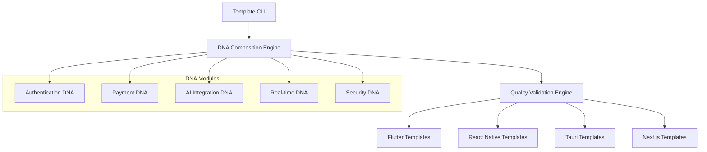
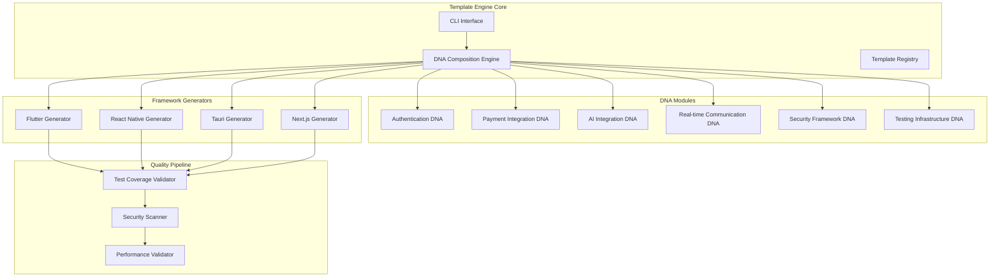
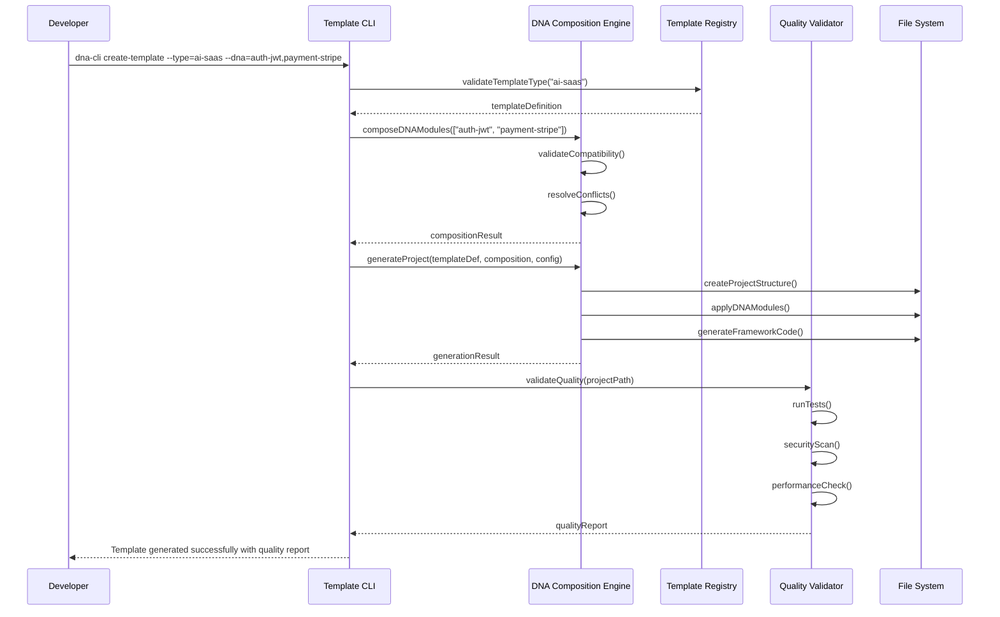
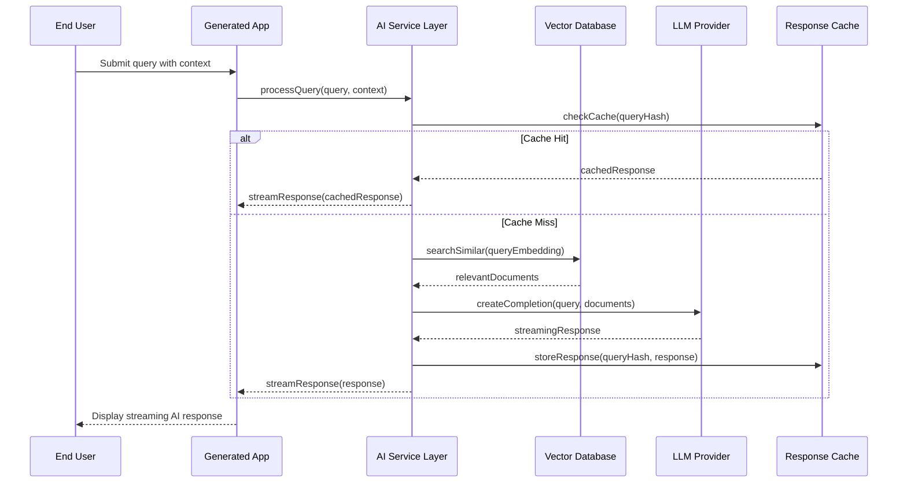
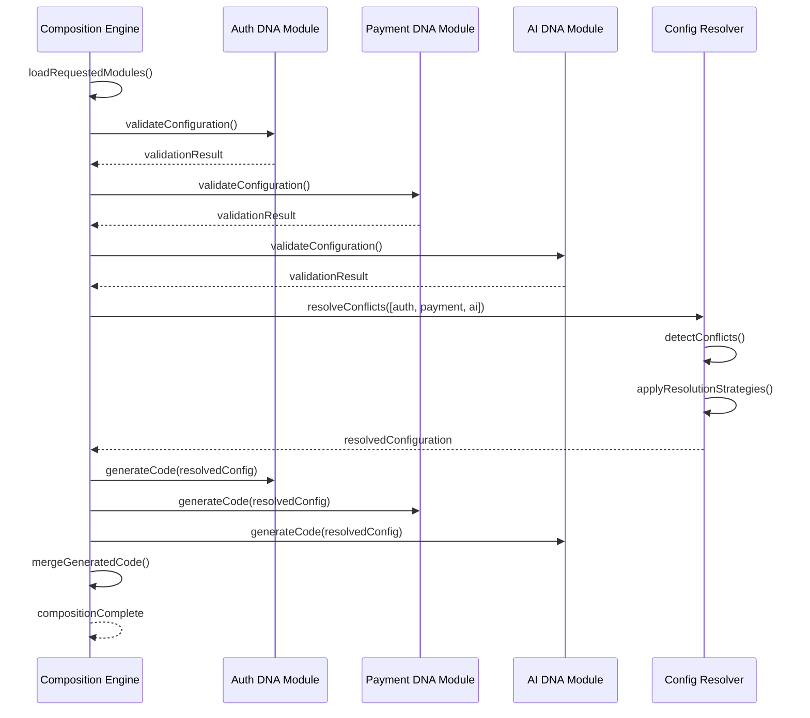

# Starter Template DNA App Architecture Document

## Introduction / Preamble

This document outlines the comprehensive technical architecture for the Starter
Template DNA App, an AI-native template ecosystem designed to eliminate
development friction while establishing production-ready foundations. The
architecture enables rapid template generation (<10 minutes), modular DNA
composition, and enterprise-scale deployment capabilities.

**Relationship to Frontend Architecture:** Given the multi-framework nature of
this system (Flutter, React Native, Next.js, Tauri), individual frontend
architectures will be documented separately for each template type, while this
document establishes the foundational technical decisions and DNA module
patterns.

## Table of Contents

- [Technical Summary](#technical-summary)
- [High-Level Overview](#high-level-overview)
- [Architectural / Design Patterns Adopted](#architectural--design-patterns-adopted)
- [Component View](#component-view)
- [Project Structure](#project-structure)
- [API Reference](#api-reference)
- [Data Models](#data-models)
- [Core Workflow / Sequence Diagrams](#core-workflow--sequence-diagrams)
- [Definitive Tech Stack Selections](#definitive-tech-stack-selections)
- [Infrastructure and Deployment Overview](#infrastructure-and-deployment-overview)
- [Error Handling Strategy](#error-handling-strategy)
- [Coding Standards](#coding-standards)
- [Overall Testing Strategy](#overall-testing-strategy)
- [Security Best Practices](#security-best-practices)

## Technical Summary

The Starter Template DNA App implements a **monorepo-based template generation
ecosystem** with pluggable DNA modules enabling intelligent composition of
cross-platform applications. The system leverages a microservices-ready modular
architecture that supports atomic updates while maintaining clear boundaries for
independent template evolution. Core innovations include AI-native integration
patterns, framework-agnostic DNA modules, and automated quality validation
ensuring 80%+ test coverage across all generated templates.

The architecture prioritizes **Flutter as the testing ecosystem leader** while
supporting React Native for enterprise adoption and Tauri for
performance-critical applications. All templates include production-ready AI
integration with multi-LLM provider support, streaming response capabilities,
and comprehensive cost optimization.

## High-Level Overview

**Architectural Style:** Modular Monorepo with Microservices-Ready Component
Architecture **Repository Structure:** Nx-managed monorepo enabling shared
tooling and atomic template releases **Primary Data Flow:** Template Selection →
DNA Composition → Code Generation → Quality Validation → Deployment Ready
Application

The system operates through three primary layers:

1. **Template Engine Layer:** CLI tools, DNA composition engine, and quality
   validation
2. **DNA Module Layer:** Pluggable authentication, payment, AI, and
   infrastructure components
3. **Template Instance Layer:** Generated applications with framework-specific
   optimizations



## Architectural / Design Patterns Adopted

- **Template Method Pattern** - _Rationale:_ Standardized template generation
  process with framework-specific implementations
- **Strategy Pattern** - _Rationale:_ DNA modules implementing consistent
  interfaces with different providers (AI, auth, payments)
- **Factory Pattern** - _Rationale:_ Template instantiation based on
  requirements and DNA composition
- **Observer Pattern** - _Rationale:_ Quality validation pipeline with real-time
  feedback during generation
- **Adapter Pattern** - _Rationale:_ Unified interfaces for diverse AI
  providers, databases, and external services
- **Command Pattern** - _Rationale:_ CLI operations and template generation
  commands with undo/rollback capabilities
- **Composite Pattern** - _Rationale:_ DNA module composition enabling complex
  template assembly from simple components

## Component View

The system consists of six major architectural components organized within the
monorepo structure:

- **Template Engine Core:** Central orchestration, CLI interface, and DNA
  composition logic
- **DNA Module Registry:** Pluggable components for authentication, payments,
  AI, real-time features, security
- **Template Generators:** Framework-specific code generation (Flutter, React
  Native, Next.js, Tauri)
- **Quality Validation Pipeline:** Automated testing, security scanning,
  performance validation
- **Template Instance Manager:** Generated application lifecycle management and
  updates
- **Documentation System:** Interactive docs, video tutorials, and architecture
  decision records



## Project Structure

```plaintext
starter-template-dna/
├── .github/                    # CI/CD workflows, issue templates
│   └── workflows/
│       ├── template-validation.yml
│       ├── security-scan.yml
│       └── multi-platform-build.yml
├── apps/                       # Template showcase and documentation apps
│   ├── docs-site/             # Next.js documentation website
│   ├── cli-tool/              # Template CLI application
│   └── quality-dashboard/     # Quality metrics and analytics
├── libs/                       # Shared libraries and DNA modules
│   ├── dna-modules/           # Core DNA module implementations
│   │   ├── auth/              # Authentication DNA
│   │   │   ├── oauth/         # OAuth 2.0 implementation
│   │   │   ├── jwt/           # JWT-based authentication
│   │   │   ├── session/       # Session-based authentication
│   │   │   └── biometric/     # Mobile biometric authentication
│   │   ├── payments/          # Payment integration DNA
│   │   │   ├── stripe/        # Stripe integration
│   │   │   ├── paypal/        # PayPal integration
│   │   │   └── crypto/        # Cryptocurrency payments
│   │   ├── ai-integration/    # AI provider DNA
│   │   │   ├── openai/        # OpenAI integration
│   │   │   ├── anthropic/     # Anthropic integration
│   │   │   ├── local-models/  # Local model deployment
│   │   │   └── vector-db/     # Vector database patterns
│   │   ├── real-time/         # Real-time communication DNA
│   │   │   ├── websocket/     # WebSocket implementation
│   │   │   ├── webrtc/        # WebRTC peer-to-peer
│   │   │   └── sse/           # Server-Sent Events
│   │   ├── security/          # Security framework DNA
│   │   │   ├── encryption/    # Encryption utilities
│   │   │   ├── validation/    # Input validation
│   │   │   └── compliance/    # Compliance frameworks
│   │   └── testing/           # Testing infrastructure DNA
│   │       ├── flutter/       # Flutter testing setup
│   │       ├── react-native/  # React Native testing
│   │       ├── web/           # Web testing utilities
│   │       └── e2e/           # End-to-end testing
│   ├── template-engine/       # Core template generation engine
│   │   ├── composition/       # DNA composition logic
│   │   ├── validation/        # Template validation
│   │   ├── generation/        # Code generation utilities
│   │   └── migration/         # Template update management
│   └── shared/                # Shared utilities and types
│       ├── types/             # TypeScript type definitions
│       ├── utils/             # Common utilities
│       └── config/            # Configuration management
├── templates/                  # Template definitions and generators
│   ├── ai-native/             # AI-powered application templates
│   │   ├── saas-platform/     # Next.js + LangChain + Vector DB
│   │   ├── dev-tools/         # AI development assistance tools
│   │   ├── business-app/      # AI-enhanced business applications
│   │   └── mobile-assistant/  # Cross-platform AI assistant
│   ├── performance/           # Performance-critical templates
│   │   ├── collaboration/     # Real-time collaboration (Tauri + WebRTC)
│   │   ├── api-platform/      # High-performance API (Rust + React Native)
│   │   └── data-viz/          # Data visualization (SvelteKit + D3)
│   ├── cross-platform/        # Cross-platform foundation templates
│   │   ├── flutter-business/  # Flutter universal business suite
│   │   ├── rn-web-hybrid/     # React Native + Next.js hybrid
│   │   └── electron-modern/   # Modern Electron stack
│   └── foundation/            # Base templates and patterns
│       ├── starter-configs/   # Framework-specific starter configurations
│       ├── ci-cd/             # CI/CD pipeline templates
│       └── deployment/        # Deployment configuration templates
├── tools/                      # Development and build tools
│   ├── template-cli/          # Command-line interface implementation
│   ├── dna-composer/          # DNA composition utilities
│   ├── quality-checker/       # Quality validation tools
│   └── migration-assistant/   # Template update automation
├── docs/                       # Comprehensive documentation
│   ├── architecture/          # Architecture documentation
│   ├── dna-modules/           # DNA module documentation
│   ├── templates/             # Template-specific guides
│   ├── tutorials/             # Step-by-step tutorials
│   └── adr/                   # Architecture Decision Records
├── examples/                   # Example applications and demos
│   ├── ai-saas-demo/          # AI SaaS platform demonstration
│   ├── flutter-showcase/      # Flutter capabilities showcase
│   └── performance-benchmarks/ # Performance comparison demos
├── scripts/                    # Automation and utility scripts
│   ├── setup-dev-env.sh       # Development environment setup
│   ├── validate-templates.js  # Template validation automation
│   └── generate-docs.js       # Documentation generation
├── .env.example               # Environment variables template
├── nx.json                    # Nx workspace configuration
├── package.json               # Root package.json for monorepo
├── tsconfig.base.json         # Base TypeScript configuration
└── README.md                  # Project overview and setup guide
```

### Key Directory Descriptions

- **libs/dna-modules/**: Contains all pluggable DNA modules with standardized
  interfaces for cross-template compatibility
- **templates/**: Framework-specific template generators organized by
  application category and performance requirements
- **tools/**: Development utilities including CLI implementation, DNA
  composition engine, and quality validation pipeline
- **docs/**: Comprehensive documentation including architecture decisions,
  tutorials, and API references
- **examples/**: Working demonstrations of generated templates showcasing
  capabilities and best practices

## API Reference

### Template Generation API

The core template engine exposes both CLI and programmatic interfaces for
template generation and DNA composition.

#### Template CLI API

- **Base URL:** Command-line interface (no HTTP endpoints)
- **Authentication:** Local development environment authentication
- **Key Commands:**
  - **`create-template --type={template-type} --dna={module-list}`:**
    - Description: Generates new template with specified DNA modules
    - Parameters:
      - `template-type`: One of `ai-saas`, `flutter-business`,
        `performance-api`, `collaboration`
      - `dna`: Comma-separated list of DNA modules
        (`auth-oauth,payment-stripe,ai-openai`)
    - Example:
      `dna-cli create-template --type=ai-saas --dna=auth-jwt,payment-stripe,ai-openai,real-time-websocket`
    - Success Response: Template generated in specified directory with complete
      project structure
    - Error Handling: Validation errors for incompatible DNA combinations,
      missing dependencies
  - **`validate-template --path={template-path}`:**
    - Description: Validates generated template against quality standards
    - Parameters: `path` to generated template directory
    - Success Response: Quality report with test coverage, security scan,
      performance metrics
    - Error Response: Detailed validation failures with remediation suggestions
  - **`update-template --path={template-path} --version={target-version}`:**
    - Description: Updates existing template to newer version with migration
      assistance
    - Parameters: Template path and target version
    - Success Response: Migration completed with change summary and manual
      action items
    - Error Response: Migration conflicts requiring manual resolution

#### DNA Composition API

- **Purpose:** Validates DNA module compatibility and resolves configuration
  conflicts
- **Interface:** Programmatic TypeScript API and CLI commands
- **Key Functions:**
  - **`validateComposition(dnaModules: DNAModule[]): ValidationResult`:**
    - Description: Validates DNA module compatibility and identifies conflicts
    - Request Parameters: Array of DNA module specifications with configuration
    - Success Response: Compatibility matrix, resolved configuration,
      optimization suggestions
    - Error Response: Incompatibility details, suggested alternatives,
      resolution strategies
  - **`generateConfiguration(dnaModules: DNAModule[], targetFramework: Framework): Configuration`:**
    - Description: Generates framework-specific configuration for DNA module
      combination
    - Request Parameters: DNA modules and target framework (Flutter, React
      Native, Next.js, Tauri)
    - Success Response: Complete configuration object with environment
      variables, dependencies, setup scripts
    - Error Response: Configuration generation failures with specific error
      locations

### External APIs Consumed

#### AI Provider APIs

**OpenAI API**

- **Purpose:** LLM integration for AI-native templates
- **Base URL:** `https://api.openai.com/v1`
- **Authentication:** API Key in Header (`Authorization: Bearer {api_key}`)
- **Key Endpoints Used:**
  - **`POST /chat/completions`:**
    - Description: Chat completion with streaming support
    - Request Body: `{ "model": "gpt-4", "messages": [...], "stream": true }`
    - Success Response (200 OK): Streaming JSON responses with token usage
    - Error Response (429): Rate limit exceeded with retry-after header
  - **`POST /embeddings`:**
    - Description: Text embeddings for vector database integration
    - Request Body:
      `{ "model": "text-embedding-3-large", "input": "text to embed" }`
    - Success Response (200 OK):
      `{ "data": [{"embedding": [float array]}], "usage": {...} }`
- **Rate Limits:** 10,000 requests/minute for tier 1, 30,000 for tier 2
- **Link to Official Docs:** https://platform.openai.com/docs/api-reference

**Anthropic API**

- **Purpose:** Alternative LLM provider for AI-native templates
- **Base URL:** `https://api.anthropic.com/v1`
- **Authentication:** API Key in Header (`x-api-key: {api_key}`)
- **Key Endpoints Used:**
  - **`POST /messages`:**
    - Description: Message completion with streaming support
    - Request Body:
      `{ "model": "claude-3-5-sonnet-20241022", "messages": [...], "stream": true }`
    - Success Response (200 OK): Streaming JSON responses with usage metrics
    - Error Response (400): Invalid request with detailed error description

#### Vector Database APIs

**Pinecone API**

- **Purpose:** Vector storage and similarity search for RAG implementations
- **Base URL:** `https://{environment}-{project}.svc.{region}.pinecone.io`
- **Authentication:** API Key in Header (`Api-Key: {api_key}`)
- **Key Endpoints Used:**
  - **`POST /vectors/upsert`:**
    - Description: Insert or update vectors in index
    - Request Body:
      `{ "vectors": [{"id": "string", "values": [float array], "metadata": {}}] }`
    - Success Response (200 OK): `{ "upsertedCount": number }`
  - **`POST /query`:**
    - Description: Similarity search with optional metadata filtering
    - Request Body:
      `{ "vector": [float array], "topK": 10, "includeMetadata": true }`
    - Success Response (200 OK):
      `{ "matches": [{"id": "string", "score": float, "metadata": {}}] }`

## Data Models

### Core Template Configuration Entities

#### TemplateDefinition

- **Description:** Complete specification for a template including DNA modules
  and framework-specific configurations
- **Schema:**
  ```typescript
  export interface TemplateDefinition {
    id: string; // Unique template identifier (e.g., "ai-saas-nextjs-v1.0")
    name: string; // Human-readable template name
    description: string; // Template purpose and use case description
    framework: Framework; // Target framework (Flutter, ReactNative, NextJS, Tauri)
    dnaModules: DNAModuleReference[]; // Required and optional DNA modules
    configuration: TemplateConfiguration; // Framework-specific configuration
    qualityMetrics: QualityMetrics; // Test coverage, security, performance standards
    metadata: {
      version: string; // Semantic version
      author: string; // Template author/maintainer
      tags: string[]; // Searchable tags
      lastUpdated: Date; // Last modification timestamp
    };
  }
  ```
- **Validation Rules:**
  - ID must be unique across template registry
  - Framework must be supported by at least one DNA module
  - All required DNA modules must be compatible

#### DNAModuleReference

- **Description:** Reference to a specific DNA module with configuration
  parameters
- **Schema:**
  ```typescript
  export interface DNAModuleReference {
    moduleId: string; // DNA module identifier (e.g., "auth-oauth-v2.1")
    configuration: Record<string, any>; // Module-specific configuration
    required: boolean; // Whether module is required for template functionality
    compatibilityMatrix: CompatibilityInfo; // Framework and module compatibility
  }
  ```

#### QualityMetrics

- **Description:** Quality standards and validation results for templates
- **Schema:**
  ```typescript
  export interface QualityMetrics {
    testCoverage: {
      minimum: number; // Minimum required coverage percentage
      current: number; // Current coverage percentage
      trend: 'improving' | 'stable' | 'declining'; // Coverage trend
    };
    securityScore: {
      vulnerabilities: {
        critical: number;
        high: number;
        medium: number;
        low: number;
      };
      lastScan: Date;
    };
    performanceMetrics: {
      buildTime: number; // Build time in seconds
      bundleSize: number; // Bundle size in bytes
      startupTime: number; // Application startup time in milliseconds
    };
    maintenanceScore: number; // Overall maintainability score (0-100)
  }
  ```

### AI Integration Data Models

#### AIProviderConfiguration

- **Description:** Configuration for AI service providers with cost tracking and
  fallback strategies
- **Schema:**
  ```typescript
  export interface AIProviderConfiguration {
    providerId: string; // Provider identifier (openai, anthropic, local)
    apiKey: string; // API key (stored securely)
    baseUrl: string; // API base URL
    model: string; // Specific model identifier
    costLimits: {
      dailyLimit: number; // Daily spending limit in USD
      monthlyLimit: number; // Monthly spending limit in USD
      tokenLimit: number; // Daily token usage limit
    };
    fallbackProvider?: string; // Fallback provider ID
    caching: {
      enabled: boolean;
      ttl: number; // Cache TTL in seconds
      maxSize: number; // Maximum cache size in MB
    };
  }
  ```

#### VectorDatabaseConfiguration

- **Description:** Vector database configuration for RAG implementations
- **Schema:**
  ```typescript
  export interface VectorDatabaseConfiguration {
    provider: 'pinecone' | 'weaviate' | 'chroma' | 'qdrant';
    connectionString: string;
    indexName: string;
    dimensions: number; // Vector dimensions
    similarity: 'cosine' | 'euclidean' | 'dotproduct';
    metadata: {
      namespace?: string;
      environment?: string;
      region?: string;
    };
  }
  ```

### Template Generation Data Models

#### GenerationRequest

- **Description:** Complete request for template generation including all
  customization parameters
- **Schema:**
  ```typescript
  export interface GenerationRequest {
    templateId: string; // Template to generate
    projectName: string; // Generated project name
    outputDirectory: string; // Target directory for generation
    dnaModuleOverrides: Record<string, any>; // Custom DNA module configurations
    environmentConfig: {
      development: EnvironmentVariables;
      staging?: EnvironmentVariables;
      production?: EnvironmentVariables;
    };
    customization: {
      packageName: string; // Application package name
      displayName: string; // Application display name
      description: string; // Application description
      author: string; // Author information
    };
  }
  ```

#### GenerationResult

- **Description:** Results and status of template generation process
- **Schema:**
  ```typescript
  export interface GenerationResult {
    success: boolean;
    projectPath: string; // Generated project location
    generatedFiles: string[]; // List of generated file paths
    dnaModulesApplied: DNAModuleReference[]; // Successfully applied DNA modules
    qualityReport: QualityMetrics; // Initial quality validation results
    nextSteps: string[]; // Recommended next actions for developer
    warnings: string[]; // Non-blocking warnings
    errors?: string[]; // Generation errors if any
    executionTime: number; // Generation time in seconds
  }
  ```

## Core Workflow / Sequence Diagrams

### Template Generation Workflow



### AI Integration Workflow (RAG Implementation)



### DNA Module Composition Workflow



## Definitive Tech Stack Selections

| Category               | Technology            | Version / Details | Description / Purpose                                         | Justification                                     |
| :--------------------- | :-------------------- | :---------------- | :------------------------------------------------------------ | :------------------------------------------------ |
| **Languages**          | TypeScript            | 5.3.x             | Primary language for all tools and DNA modules                | Type safety, IDE support, ecosystem compatibility |
|                        | Rust                  | 1.75.x            | Performance-critical templates (Tauri, Axum API)              | Memory safety, performance, Tauri ecosystem       |
|                        | Dart                  | 3.2.x             | Flutter templates and applications                            | Flutter native language, null safety              |
| **Runtime**            | Node.js               | 20.x LTS          | Template engine, CLI tools, JavaScript templates              | LTS stability, ecosystem maturity                 |
|                        | Bun                   | 1.0.x             | High-performance JavaScript runtime for performance templates | Superior performance for specific use cases       |
| **Frameworks**         | Flutter               | 3.16.x            | Primary cross-platform framework (5/5 testing rating)         | Comprehensive testing, single codebase deployment |
|                        | React Native          | 0.73.x            | Enterprise mobile development framework                       | Mature ecosystem, enterprise adoption             |
|                        | Next.js               | 14.x              | AI-native web applications and SaaS platforms                 | Full-stack React, API routes, performance         |
|                        | Tauri                 | 1.5.x             | Performance-critical desktop applications                     | Small bundle size, Rust performance               |
|                        | SvelteKit             | 2.0.x             | Data visualization and performance web apps                   | Optimal bundle size, compile-time optimizations   |
| **Monorepo**           | Nx                    | 17.x              | Workspace management and build orchestration                  | Enterprise-grade monorepo tooling                 |
| **Databases**          | PostgreSQL            | 15.x              | Primary relational database for templates                     | ACID compliance, JSON support, performance        |
|                        | Redis                 | 7.2.x             | Caching, session storage, real-time features                  | In-memory performance, pub/sub capabilities       |
| **Vector Databases**   | Pinecone              | Latest            | Managed vector database for AI templates                      | Managed service, production-ready                 |
|                        | Weaviate              | 1.24.x            | Self-hosted vector database option                            | Open source, flexible deployment                  |
| **Cloud Platform**     | AWS                   | N/A               | Primary cloud provider for templates                          | Comprehensive services, enterprise adoption       |
| **Cloud Services**     | AWS Lambda            | N/A               | Serverless compute for AI processing                          | Cost-effective scaling, event-driven              |
|                        | AWS S3                | N/A               | Static asset storage and template distribution                | Reliable object storage, CDN integration          |
|                        | AWS RDS               | N/A               | Managed database services                                     | Automated backups, scaling, maintenance           |
|                        | AWS ECS               | N/A               | Container orchestration for microservices                     | Docker support, auto-scaling                      |
| **Infrastructure**     | AWS CDK               | 2.x               | Infrastructure as Code for all templates                      | Type-safe infrastructure, AWS integration         |
|                        | Docker                | Latest            | Containerization for consistent deployment                    | Environment consistency, scaling                  |
| **AI Libraries**       | LangChain.js          | 0.1.x             | AI orchestration and chain management                         | Comprehensive LLM tooling, provider abstraction   |
|                        | OpenAI SDK            | 4.x               | OpenAI API integration                                        | Official SDK, streaming support                   |
|                        | Anthropic SDK         | 0.17.x            | Anthropic API integration                                     | Official SDK, Claude models                       |
| **State Management**   | Riverpod              | 2.4.x             | Flutter state management                                      | Compile-time safety, testing support              |
|                        | Redux Toolkit         | 2.0.x             | React/React Native state management                           | DevTools, immutability, async handling            |
|                        | Zustand               | 4.4.x             | Lightweight state for performance-critical apps               | Minimal boilerplate, TypeScript support           |
| **UI Libraries**       | Flutter Material 3    | Latest            | Material Design 3 for Flutter applications                    | Modern design system, platform adaptive           |
|                        | React Native Elements | 3.x               | React Native UI component library                             | Comprehensive components, theming                 |
|                        | Tauri UI              | Latest            | Native UI components for Tauri applications                   | Native performance, platform integration          |
|                        | Tailwind CSS          | 3.4.x             | Utility-first CSS for web templates                           | Rapid styling, design system integration          |
| **Testing**            | Flutter Test          | Latest            | Flutter widget and integration testing                        | Framework-native, golden file support             |
|                        | Jest                  | 29.x              | JavaScript/TypeScript unit testing                            | Ecosystem standard, snapshot testing              |
|                        | Detox                 | 20.x              | React Native E2E testing                                      | Gray box testing, device automation               |
|                        | Playwright            | 1.40.x            | Web and desktop E2E testing                                   | Cross-browser, reliable automation                |
| **CI/CD**              | GitHub Actions        | Latest            | Continuous integration and deployment                         | Git integration, matrix builds                    |
| **Security**           | Snyk                  | Latest            | Dependency vulnerability scanning                             | Comprehensive vulnerability database              |
|                        | ESLint Security       | Latest            | Static code security analysis                                 | Rule-based security checking                      |
| **Real-time**          | Socket.io             | 4.7.x             | WebSocket abstraction with fallbacks                          | Reliability, browser compatibility                |
|                        | WebRTC                | Native            | Peer-to-peer real-time communication                          | Direct peer connections, media streaming          |
| **Development Tools**  | Prettier              | 3.x               | Code formatting across all languages                          | Consistent code style, IDE integration            |
|                        | ESLint                | 8.x               | JavaScript/TypeScript linting                                 | Code quality, error prevention                    |
| **Package Management** | npm                   | 10.x              | Primary package manager for Node.js                           | Ecosystem standard, security features             |
|                        | pub                   | Latest            | Dart/Flutter package manager                                  | Flutter ecosystem, version resolution             |
|                        | cargo                 | Latest            | Rust package manager                                          | Rust ecosystem, dependency management             |

## Infrastructure and Deployment Overview

- **Cloud Provider:** AWS (primary), with multi-cloud template support for Azure
  and GCP
- **Core Services Used:** Lambda (serverless AI processing), S3 (template
  storage/distribution), RDS (PostgreSQL), ElastiCache (Redis), ECS (container
  orchestration), CloudFront (CDN)
- **Infrastructure as Code (IaC):** AWS CDK with TypeScript - Location:
  `libs/infrastructure/` and template-specific `infra/` directories
- **Deployment Strategy:** Multi-stage CI/CD with automated quality gates -
  GitHub Actions with template-specific deployment workflows
- **Environments:** Development (local + cloud dev), Staging (production-like),
  Production (multi-region)
- **Environment Promotion:** `development` → `staging` (automated after tests
  pass) → `production` (manual approval + automated deployment)
- **Rollback Strategy:** AWS CDK stack rollback for infrastructure, container
  image rollback for applications, feature flag toggles for gradual rollbacks

## Error Handling Strategy

- **General Approach:** Structured error handling with typed exceptions,
  comprehensive logging, and graceful degradation for AI services
- **Logging:**
  - Library/Method: Winston (Node.js), slog (Rust), Flutter logging for
    framework-specific implementations
  - Format: Structured JSON logging with correlation IDs, user context, and
    operation metadata
  - Levels: DEBUG (development), INFO (operations), WARN (recoverable issues),
    ERROR (failures), CRITICAL (system issues)
  - Context: Correlation ID, user ID (when applicable), template ID, DNA module
    context, operation name, performance metrics
- **Specific Handling Patterns:**
  - **AI API Calls:** Exponential backoff with jitter using
    `exponential-backoff` library, circuit breaker pattern with 5-failure
    threshold, 30-second timeout, fallback to cached responses or alternative
    providers
  - **Template Generation Errors:** Validation error aggregation with detailed
    remediation suggestions, partial generation recovery with rollback to last
    stable state, dependency resolution failure handling with alternative
    suggestions
  - **DNA Module Conflicts:** Conflict detection with resolution strategies,
    configuration override mechanisms, compatibility matrix validation with
    suggested alternatives

## Coding Standards

**These standards are mandatory for all AI-generated code and must be enforced
during template generation.**

- **Primary Runtime:** Node.js 20.x LTS, Rust 1.75.x, Dart 3.2.x
- **Style Guide & Linter:**
  - TypeScript: ESLint with `@typescript-eslint/recommended` + Prettier
  - Rust: rustfmt + clippy with `pedantic` level
  - Dart: `dart format` + `dart analyze` with `lints` package
  - Configuration files: `.eslintrc.js`, `rustfmt.toml`, `analysis_options.yaml`
- **Naming Conventions:**
  - Variables: `camelCase` (TypeScript/Dart), `snake_case` (Rust)
  - Functions/Methods: `camelCase` (TypeScript/Dart), `snake_case` (Rust)
  - Classes/Types/Interfaces: `PascalCase` (all languages)
  - Constants: `UPPER_SNAKE_CASE` (all languages)
  - Files: `kebab-case.ts`, `snake_case.rs`, `snake_case.dart`
  - DNA Modules: `kebab-case` directory names, `PascalCase` class names
- **File Structure:** Adhere to framework-specific conventions with shared DNA
  module interfaces
- **Unit Test File Organization:**
  - TypeScript: `*.test.ts` co-located with source files
  - Rust: `tests/` directory with integration tests, `#[cfg(test)]` for unit
    tests
  - Dart: `test/` directory mirroring `lib/` structure
- **Asynchronous Operations:**
  - TypeScript: Always use `async`/`await`, avoid Promise callbacks
  - Rust: Use `tokio` for async runtime, `async`/`await` syntax
  - Dart: Use `async`/`await` with proper `Future` handling
- **Type Safety:**
  - TypeScript: Strict mode enabled, no `any` types without justification
  - Rust: Leverage ownership system, minimize `unsafe` code
  - Dart: Null safety enabled, sound null safety compliance

### Language-Specific Conventions

#### TypeScript/Node.js Specifics:

- **Immutability:** Use `readonly` types, `const` assertions, immutable data
  patterns
- **Error Handling:** Custom error classes extending base `AppError`, structured
  error responses
- **Module System:** ES Modules exclusively, consistent import/export patterns
- **DNA Module Integration:** Standardized interfaces in
  `libs/shared/types/dna.ts`

#### Rust Specifics:

- **Memory Safety:** Zero `unsafe` code in DNA modules, comprehensive ownership
  handling
- **Error Handling:** `Result<T, E>` pattern with custom error types, `anyhow`
  for application errors
- **Performance:** Profile-guided optimization for release builds, minimal
  allocations in hot paths
- **Async Patterns:** Tokio runtime, stream processing for real-time features

#### Dart/Flutter Specifics:

- **State Management:** Riverpod with provider patterns, immutable state objects
- **Widget Architecture:** Stateless widgets preferred, clear separation of
  concerns
- **Platform Integration:** Platform channels for native functionality,
  conditional compilation
- **Testing Focus:** Widget tests for UI, integration tests for flows, golden
  file tests for visual regression

## Overall Testing Strategy

**Comprehensive testing across all generated templates with framework-specific
optimizations.**

- **Tools:** Framework-specific testing libraries with shared quality standards
- **Unit Tests:**
  - **Scope:** Individual functions, classes, DNA modules, template generation
    logic
  - **Location:** Co-located with source files following framework conventions
  - **Mocking:** Framework-specific mocking (Jest for TS, mockall for Rust,
    mockito for Dart)
  - **AI Agent Responsibility:** Generate comprehensive unit tests for all DNA
    modules and template logic
- **Integration Tests:**
  - **Scope:** DNA module interactions, template generation pipeline, AI service
    integration
  - **Environment:** Testcontainers for databases, mock AI services, isolated
    test environments
  - **AI Agent Responsibility:** Generate integration tests for critical DNA
    module combinations
- **End-to-End Tests:**
  - **Scope:** Complete template generation workflows, generated application
    functionality
  - **Tools:** Playwright (web), Detox (React Native), Flutter integration
    tests, custom Rust test harness
  - **AI Agent Responsibility:** Generate E2E test scripts for critical user
    journeys
- **Template-Specific Testing:**
  - **Flutter:** Widget tests, golden file visual regression, integration tests
    with flutter_driver
  - **React Native:** Jest unit tests, Detox E2E tests, component testing with
    React Native Testing Library
  - **Web (Next.js/SvelteKit):** Vitest unit tests, Playwright E2E tests,
    accessibility testing with axe
  - **Tauri:** Rust unit tests, web component tests, native integration tests
- **Quality Gates:**
  - 80% minimum code coverage across all templates
  - Zero critical security vulnerabilities
  - Performance regression detection with 10% tolerance
  - Accessibility compliance (WCAG 2.1 AA) for UI templates

## Security Best Practices

**Security-first architecture with automated scanning and validation.**

- **Input Sanitization/Validation:** Framework-specific validation libraries
  (Zod for TypeScript, serde for Rust, built_value for Dart) with consistent
  validation patterns across all DNA modules
- **AI Security:** Input sanitization for LLM prompts, output validation
  preventing prompt injection, content filtering for generated responses, rate
  limiting for AI API calls
- **Secret Management:** AWS Secrets Manager for production, local environment
  variables for development, secure secret rotation, no hardcoded secrets in
  templates
- **Dependency Security:** Automated vulnerability scanning with Snyk,
  dependency update automation with security patch prioritization, supply chain
  attack prevention
- **Template Security:** Security-focused DNA modules, automated security
  testing in CI/CD, security-first default configurations, OWASP compliance
- **Authentication/Authorization:** JWT with secure refresh patterns, OAuth 2.0
  with PKCE, role-based access control, session management with secure cookies
- **Data Protection:** Encryption at rest and in transit, PII handling
  guidelines, GDPR compliance patterns, audit logging for sensitive operations
- **API Security:** Rate limiting with Redis, input validation at API
  boundaries, CORS configuration, security headers (CSP, HSTS, X-Frame-Options)

---

**Architecture Document Complete - Ready for Implementation**

This comprehensive architecture establishes the foundation for the Starter
Template DNA App ecosystem, enabling rapid generation of production-ready
applications with AI-native capabilities, comprehensive testing, and
enterprise-scale security.
